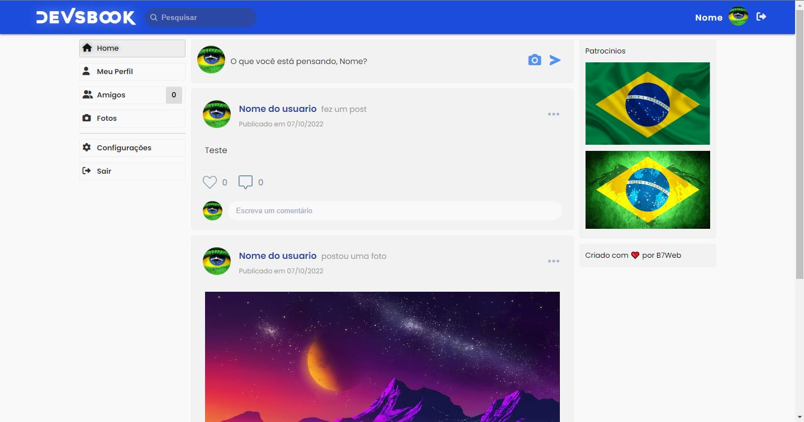
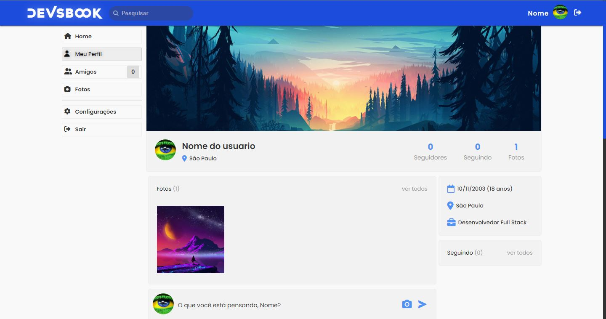

  

---

<h1 align="center"> Devsbook</h1>

<h3 align="center">✔ STATUS: Concluído ✔</h3>

---

<h2 align="center">📖Sobre</h2>

Esse projeto foi realizado junto as aulas de PHP usando POO com MySQL da B7Web. 
Ele consiste em ser uma mini rede social com uma página inicial que verifica primeiramente se você esta logado ou não, se não estiver, ela manda você para a página de login,
e se você não tem uma conta, basta criar na pagina de cadastro. 
Ela contem um menu lateral com rotas para todas as paginas, inclusive uma opção para sair/logout, na pagina inicial é possível publicar um post sendo de texto ou foto,
e nela você consegue ver todos os seus posts e os posts de pessoas que o usuário esta seguindo, com um limite para a paginação, e também contém um campo de busca para pesquisar
os usuários existentes. 
A página do perfil do usuário mostra as fotos mais recentes, quantidades de seguidores, informações pessoais como trabalho, cidade e data de nascimento, e por fim, todos os posts do usuário. 
Na pagina de amigos mostra todos os seguidores do usuário e quem ele esta seguindo. 
Na pagina de foto mostra todas as fotos que o usuário já postou. 
E por fim, a página de configurações, que nela é possível adicionar ou atualizar todas as suas informações, como nome, e-mail, data de nascimento, cidade, trabalho, foto de perfil, foto de capa e senha,
e uma opção para deletar a conta do usuário com uma prévia confirmação da senha.

---

<h2 align="center">✔O site contém:</h2>

✅ Consexão com banco de dados MySQL 
✅ CRUD 
✅ Login/Cadastro 
✅ Navbar 
✅ Modal 
✅ Upload de imagems 
✅ Paginação 
### etc...
---

O projeto vai ser iniciado em <a target="_blank" href='http://localhost/devsbook/'>http://localhost/devsbook

<h2 align="center">🖥Preview</h2>

</img>
 
 
</img>

---

<h2 align="center">🛠 Tecnologias</h2>

- [PHP](https://www.php.net/)
- [HTML](https://html.com/)
- [CSS](https://developer.mozilla.org/pt-BR/docs/Web/CSS)
- [MySQL](https://www.mysql.com/)

---

<h2 align="center">📝Licença</h2>

   Este repositório está sob licença MIT. Você pode ver o arquivo <a href="https://github.com/gabriell-c/devsbook/blob/main/LICENSE">LICENSE</a>
   para mais detalhes. 😉

